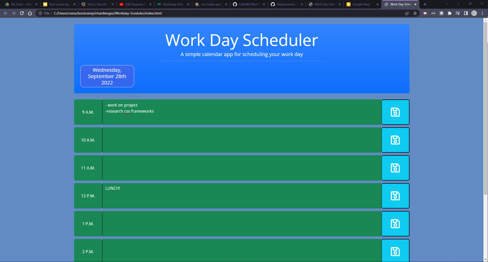
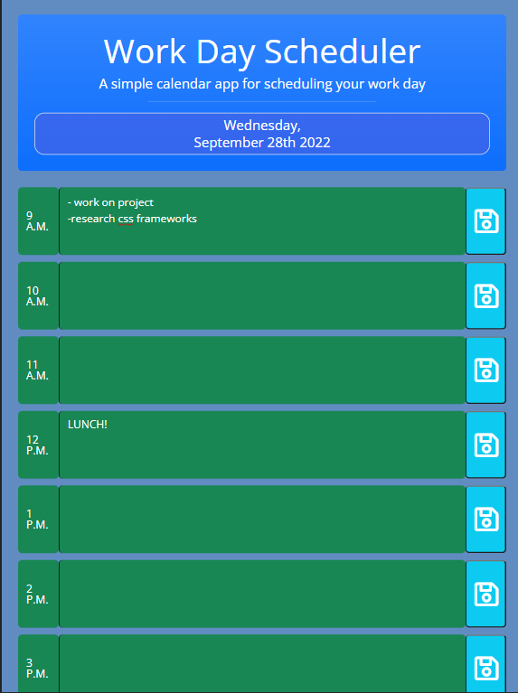

# 05 Third-Party APIs: Work Day Scheduler


## User Story

```md
AS AN a new deveoper with a busy schedule
I WANT create an app that will help plan my day
SO THAT I can manage my time effectively
```

## Acceptance Criteria

```md
GIVEN I am using a daily planner to create a schedule
WHEN I open the planner
THEN the current day is displayed at the top of the calendar
WHEN I scroll down
THEN I am presented with timeblocks for standard business hours
WHEN I view the timeblocks for that day
THEN each timeblock is color coded to indicate whether it is in the past (gray), present (red), or future (green)
WHEN I click into a timeblock
THEN I can enter an event
WHEN I click the save button for that timeblock
THEN the text for that event is saved in local storage
WHEN I refresh the page
THEN the saved events persist
```

The following animation demonstrates the application functionality:





## Links
```md
app url:
https://coles82.github.io/Workday-Sceduler/

github repo:
https://github.com/ColeS82/Workday-Sceduler
```

## Colaborators
No body to thank yet.